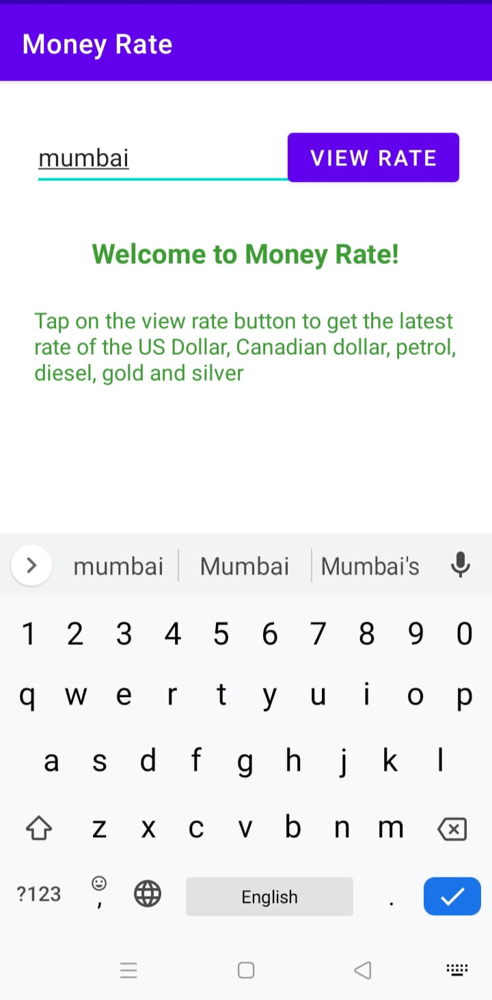
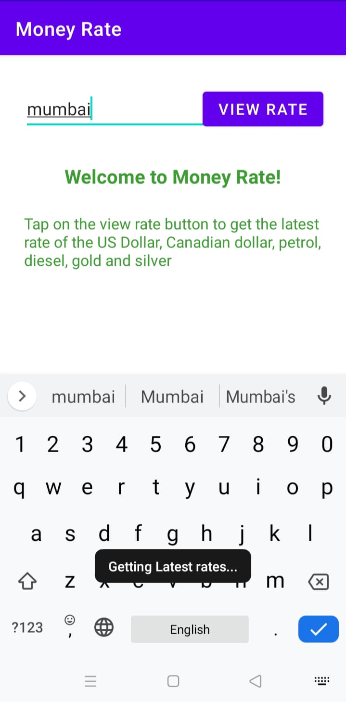
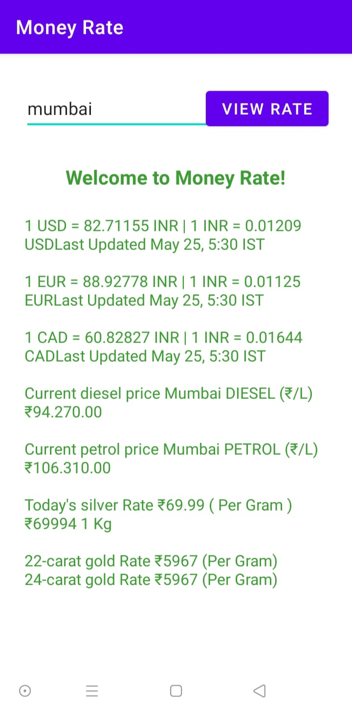
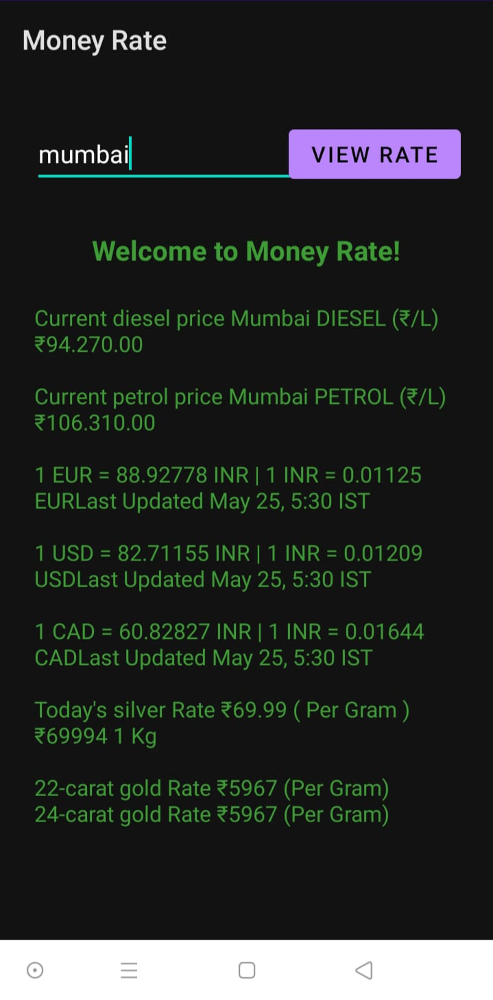

# Money-Rate
An App in JAVA using Android Studio in which you get latest currency exchange rates of Dollar & Euro, price of Gold, Silver, petrol and diesel by selecting your city.

# How to download ?
You can download the file from above source code under filename as "Money-Rate.apk" or [Click here](https://github.com/TaranjeetSinghKalsi/Money-Rate/blob/master/Money-Rate.apk) to view apk file.

# App Preview / Screenshots
#### Note - Use VPN if images are not visible. There might be DNS problem with your network operator.
- Initial View

- Entering City

- Clicked on View Rate

- Final View

- Dark Mode View

